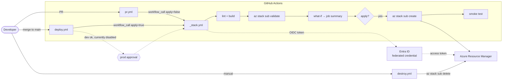
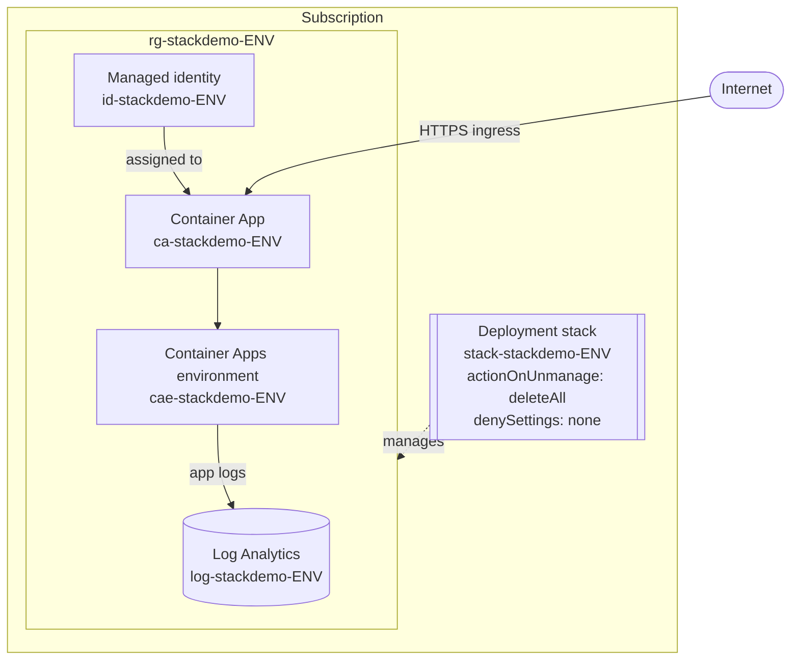

# Architecture

## Deployment flow

```mermaid
flowchart LR
    dev([Developer]) -->|PR| pr[pr.yml]
    dev -->|merge to main| deploy[deploy.yml]

    subgraph GH[GitHub Actions]
        pr -->|workflow_call apply=false| stack[_stack.yml]
        deploy -->|workflow_call apply=true| stack
        stack --> s1[lint + build] --> s2[az stack sub validate] --> s3[what-if → job summary] --> s4{apply?}
        s4 -->|yes| s5[az stack sub create] --> s6[smoke test]
    end

    stack -.->|OIDC token| entra[Entra ID<br/>federated credential]
    entra -.->|access token| arm[Azure Resource Manager]
    s5 --> arm

    deploy -.->|dev ok, currently disabled| gate{{prod approval}} -.-> stack

    dev -->|manual| destroy[destroy.yml] -->|az stack sub delete| arm
```

## What the stack manages

```mermaid
flowchart TB
    subgraph SUB[Subscription]
        stk[[Deployment stack<br/>stack-stackdemo-ENV<br/>actionOnUnmanage: deleteAll<br/>denySettings: none]]

        subgraph RG[rg-stackdemo-ENV]
            log[(Log Analytics<br/>log-stackdemo-ENV)]
            id[Managed identity<br/>id-stackdemo-ENV]
            cae[Container Apps environment<br/>cae-stackdemo-ENV]
            ca[Container App<br/>ca-stackdemo-ENV]
        end
    end

    stk -. manages .-> RG
    cae -->|app logs| log
    ca --> cae
    id -->|assigned to| ca
    user([Internet]) -->|HTTPS ingress| ca
```
